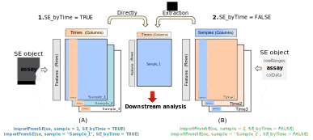

```{r, include = FALSE}
knitr::opts_chunk$set(
  collapse = TRUE,
  comment = "#>"
)
options(knitr.table.format = "html")
```

```{r setup, include=FALSE, comment=FALSE, echo=FALSE}
library(tscR)
library(dplyr)
library(grid)
library(ggplot2)
library(latex2exp)
library(dtw)
```

# Overview

Clustering is an unsupervised learning technique widely used in several disciplines, such as machine learning, bioinformatics, image analysis or pattern recognition. Gene expression data clustering -- as well as in other omic disciplines -- is useful to find groups of genes with similar behavior and may provide very useful information for the understanding of certain biological processes.


This clustering of gene expression data can be performed onto genes, samples or over the time variable. In the last case, called 'time series genes expression', it is possible to identify genes with similar conduct and obtain sets of responses to certain situations. This has allowed to highlight environmental stress response, circadian rhythms pathway, treatment response, etc.


Despite the fact that there are several generic R packages for the analysis of clustering time series -- _kmlShape_ , _dtwclust_, _clue_, _TSclust_ --, there is no a single algorithm that satisfactorily solves all problems and each clustering problem requires a specific approach. There are other specific packages to clustering time series in gene expression which seek minimize the high sensitivity to noise of other generic algorithms --  _TSMixclust_, _ctsGE_, _MFuzz_ -- . _MFuzz_ minimizes the high noise sensitivity of other algorithms through a fuzzy clustering, on the other hand _TSMixclust_ is a soft-clustering that uses mixed-effects models with non-parametric smoothing spline fitting. _ctsGE_ seeks to minimize noisy data in two steps, first define groups based on their expression profiles (expression index) and then, genes with same index are clustered by applying kmeans. Despite the fact that these methods attempt to solve the important task of minimizing the impact of the noise on clustering, genes with similar expression -- in magnitude -- typically end up in the same groups, even though they have different temporal evolutions.


Occasionally, however, the researcher's main interest lies in finding genes with similar patterns (similar trajectories) although these occur at different levels of expression. Therefore, genes with a similar temporal evolution are therefore sought regardless of their magnitude of expression. 


Let us suppose that we subject an individual to a treatment and measure the expression of three (or ten thousand) of his genes at the time the treatment begins, at one week, two weeks and three weeks after (Fig. 1).

The lines in figure 1 (`a`,`b`,`c`) represent 3 tracks (e.g. the expression of 3 genes at 4 different times). The trajectories $T_a$ and $T_c$ are identical in terms of slopes, they only differ in the magnitude of their expression. On the other hand the track $T_b$ would be closer to the track $T_a$ than to $T_c$.

```{r warning=F, fig.cap= "Figure 1. Three different trajectories at four times to exemplify the possible relationships or classifications of the data.", echo=FALSE, fig.align='left'}

a <- c(10, 15, 17, 25)
b <- c(5, 8, 6, 9 )
c <- c(-19, -14, -12, -4)
x <- c(1, 2, 3, 4)

df <- as.data.frame(cbind(x,a,b,c))

ggplot(df, aes(x=x))+ 
  geom_line(aes(y=a), color = "red")+
  geom_point(y=a, col="red")+
  geom_line(aes(y=b))+
  geom_point(y=b)+
  geom_line(aes(y=c), color = "steelblue")+
  geom_point(y=c, color="steelblue")+
  geom_label(aes(x=1.5, y=14, label = TeX("$S_{a1}$", output="character")), parse=TRUE   ) +
  geom_label(aes(x=2.5, y=17, label = TeX("$S_{a2}$", output="character")), parse=TRUE  ) +
  geom_label(aes(x=3.5, y=23, label = TeX("$S_{a3}$", output="character")), parse=TRUE  ) +
  geom_label(aes(x=1.5, y=7.5, label = TeX("$S_{b1}$", output="character")), parse=TRUE  ) +
  geom_label(aes(x=2.5, y=8, label = TeX("$S_{b2}$)", output="character")), parse=TRUE  ) +
  geom_label(aes(x=3.5, y=9, label = TeX("$S_{b3}$", output="character")), parse=TRUE  ) + 
  geom_label(aes(x=1.5, y=-15, label = TeX("$S_{c1}$", output="character")), parse=TRUE  ) +
  geom_label(aes(x=2.5, y=-12, label = TeX("$S_{c2}$", output="character")), parse=TRUE  ) +
  geom_label(aes(x=3.5, y=-7, label = TeX("$S_{c3}$", output="character")), parse=TRUE  ) +
  geom_text(aes(x=1, y=12, label = "Traject. a"))+
  geom_text(aes(x=1, y=4, label = "Traject. b"))+
  geom_text(aes(x=1, y=-17, label = "Traject. c"))+
  theme(legend.position = "none")+
  xlab("") + ylab("")

```

Intuitively, if we had to determine the distance between these trajectories, we would think that $T_a$ is closer to $T_b$ than to $T_c$. In addition, $T_c$ is closer to $T_b$ than to $T_a$. You could quantify those distances with different metrics:

* Euclidean distance

```{r echo=FALSE}
dfx <- as.matrix(rbind(a,b,c))
dsE <- round( dist(dfx, method = "euclidean", diag = FALSE, upper = FALSE), 3)
```

$$
\begin{matrix}
 & a &b \\ 
b & 21.24 & \\ 
c & 54.00 & 39.41 
\end{matrix}
$$

Other distance metrics based more specifically on time series such as Fréchet or DTW provide similar results:

```{r echo=FALSE}
time <- c(1,2,3,4)
dF <- tscR::frechetDistC(dfx, time)
```

* Fréchet Distance

$$
\begin{matrix}
 & a &b \\ 
b & 16 & \\ 
c & 29 & 24 
\end{matrix}
$$

* DTW Distance

```{r echo=FALSE}
dt1 <- dtwDist(matrix(c(a,b), byrow = TRUE, nrow = 2))
dt2 <- dtwDist(matrix(c(a,c), byrow = TRUE, nrow = 2))
dt3 <- dtwDist(matrix(c(b,c), byrow = TRUE, nrow = 2))
```

$$
\begin{matrix}
 & a & b \\ 
b & 42 & \\ 
c & 158 & 104 
\end{matrix}
$$

However, if the main interest is to determine which trajectories have similar behaviour over time regardless of the magnitude of their expression, it is necessary to use purely geometric criteria and look for similarities based on their slopes. In this case, the distance matrix would look as follows:

$$
\begin{matrix}
 & a & b \\ 
b & 6.71 & \\ 
c & 0.00 & 6.71 
\end{matrix}
$$
Where it can be seen that the distance between the $a$ and $c$ trajectory is zero because these are two lines with identical slopes and the distance from both to $b$ is the same.

Therefore, we might find a researcher interested in identifying and grouping sets of genes with similar behaviours according to different points of view:

* Genes clustered with similar levels of expression, i.e. genes whose trajectories are close in terms of physical distance (fig.2 B).

* Genes grouped with similar evolution regardless of their physical distance. In this second scenario, we are dealing with genes that respond in a similar way, but with different intensity (fig.2 C).

* It might also be interesting to group genes according to both factors (distance + tendency) (fig.2 D).

```{r echo=FALSE, fig.align='left', fig.cap="Figure 2. Different possibilities of classifying the tracks from the whole data set (a) according to its Fréchet distances (b), according to its slopes (c) or a combination of both (d)."}

df <- data.frame(T1 = c(140,100,75,35), T2=c(120,120,50,48), T3 = c(100,140,35,70))

df1 <- matrix(NA, nrow=10, ncol=3)
df2 <- matrix(NA, nrow=10, ncol=3)
df3 <- matrix(NA, nrow=10, ncol=3)
df4 <- matrix(NA, nrow=10, ncol=3)
for(i in seq(1,10)){
  df1[i,] <- jitter(as.numeric(df[1,]), factor = 1.5)
  df2[i,] <- jitter(as.numeric(df[2,]), factor = 1.5)
  df3[i,] <- jitter(as.numeric(df[3,]), factor = 1.5)
  df4[i,] <- jitter(as.numeric(df[4,]), factor = 1.5)
  }
df <- as.data.frame(rbind(df1,df2,df3,df4))
names(df) <- c("T1","T2","T3")

df <- as.data.frame.table(t(df))
df$Var3 <- rep(c("A","B","C","D"), each=30)

p1 <- df %>% 
ggplot( aes_(~Var1, ~Freq, group=~Var2) ) + 
  geom_line() + 
    theme(legend.position = "none", plot.title = element_text(hjust = 0.5)) + 
  xlab("(A)") + ylab("") + ggtitle(label = "Raw trajectories")

p2 <- df %>%
  mutate(Var4 = recode(Var3, "B" = "A")) %>%
  mutate(Var4 = recode(Var4, "D" = "C")) %>% 
ggplot( aes_(~Var1, ~Freq, group=~Var2, colour=~Var4) ) + 
  geom_line() +
  theme(legend.position = "none", plot.title = element_text(hjust = 0.5)) + 
  xlab("(B)") + ylab("") + ggtitle(label = "Fréchet based cluster")

p3 <- df %>%
  mutate(Var4 = recode(Var3, "C" = "A")) %>%
  mutate(Var4 = recode(Var4, "D" = "B")) %>% 
ggplot( aes_(~Var1, ~Freq, group=~Var2, colour=~Var4) ) + 
  geom_line() +
  theme(legend.position = "none", plot.title = element_text(hjust = 0.5)) + 
  xlab("(C)") + ylab("") + ggtitle(label = "Slope based cluster")

p4 <- df %>%
ggplot( aes_(~Var1, ~Freq, group=~Var2, colour=~Var3) ) + 
  geom_line() +
  theme(legend.position = "none", plot.title = element_text(hjust = 0.5)) + 
  xlab("(D)") + ylab("") + ggtitle(label = "Combined clusters")


gridExtra::grid.arrange(p1,p2,p3,p4, nrow=2)

```

Through this package we propose a methodology that allows to group these paths based on physical distances by using distance metrics adapted to time series (Fréchet's distance) and a new approach based on similarity of slopes between trajectories, where the trajectories are grouped according to this proximity regardless of the distance between them.

Furthermore, a combination of both classifications is available, so that the final result would be trajectories grouped according to their values and their evolutions.

Since in many studies (especially in different comic disciplines), the number of trajectories can be very large (thousands or tens of thousands), a methodology has been developed based on the existing one in the _kmlShape_ package. By means of a pre-grouping, a series of "representatives" of the trajectories is obtained, called senators; these senators are then classified by means of some of the proposed algorithms.  At last, the set of trajectories is assigned to the cluster to which its senator has been assigned. In this way the computational cost and the risk of overflowing the memory is reduced.

# Getting started

Install from Bioconductor

```{r eval=FALSE, echo=TRUE}
if (!requireNamespace("BiocManager"))
install.packages("BiocManager")
BiocManager::install("tscR")
```

Install the latest development version in `install_github`.

```{r eval = FALSE, echo=TRUE}
devtools::install_github("fpsanz/tscR")
```

Read the vignette (this document):

```{r eval = TRUE}
library(tscR)
```
```{r eval =FALSE}
browseVignettes("tscR")
```


# Simple clustering 

## Based on slope distance

The input data has to be a dataframe or matrix where the rows will be each of the trajectories and the columns the times (Table 1).

Initially, we are going to load a set of example trajectories included in the library.

```{r eval = TRUE, echo = TRUE, results='asis'}
data(tscR)
df <- tscR
```

```{r eval=TRUE, echo=FALSE, results='asis'}
knitr::kable(head(round(df,3)), 
             caption = "Table 1. First six rows from the example data matrix at three different times that have been studied for one sample.",
             align = c('c', 'c', 'c'), format="html") %>%
  gsub("<caption>",'<caption style="text-align:left;">', .)
```

tscR includes 300 observations (trajectories) with data taken at 3 regular time-points (day 1, day 2, day 3).

```{r echo = F, eval=TRUE, fig.align="left", fig.cap="Figure 3. Set ot 300 example trajectories that tscR package includes to work with."}
matplot(t(df), type = "l", col = "gray30", lty = 1, ylab = "")
```


Following this, the similarity matrix is calculated and its size will be n x n, where n represents the number of rows in the input matrix. This matrix is an object of ''dist'' class and contains the similarities between trajectories based on similar slopes.

```{r eval = TRUE, echo = TRUE}
time <- c(1,2,3)
sDist <- slopeDist(df, time)
```

The next step would involve grouping the trajectories based on similarities in their slopes regardless of the distance between them *(meter referencia al paper)*.

```{r eval=TRUE, echo=TRUE}
sclust <- getClusters(sDist, k = 3)
```

The result may be displayed with the `plotCluster` function. This function assumes as parameters the original data (data), the object obtained from `getClusters` (clust) and the clusters to be displayed: "all" to display them all in a single graphic, an integer to display the trajectories of that cluster or a vector defining which clusters should be displayed (one per subplot).

```{r eval=T, echo=T}
plotCluster(data = df,
            clust = sclust,
            ncluster = "all")
```

```{r eval=T, echo=T}
plotCluster(df, sclust, 1)
```

```{r eval=T, echo=T}
plotCluster(df, sclust, c(1:2))
```

As it can be appreciated in this last graph, the trajectories with descending - ascending evolution have been grouped on one side, independently of their distance (left plot) and those with ascending - descending evolution on the other side (right plot).

## Based on Fréchet distance

This is a measure of similarity between curves that takes into account the location and order of the points along the curve.

The procedure seems to be similar to the previous case:

* Calculate distance matrix.
* Get the clusters.
* Display the results.

```{r eval = TRUE, echo = TRUE}
fdist <- frechetDistC(df, time)
fclust <- getClusters(fdist, 3)
plotCluster(df, fclust, "all")
```

Note that the clustering has more to do with the distance (in Euclidean terms) between trajectories rather than with the slopes themselves, as illustrated in the overview. In particular circumstances, this may be the classification of interest.

## Combined clusters

A third option would be to combine the results of both clusters in such a way that groups of trajectories would be obtained based on both distance and similarity of slopes.

To this end, the `combineCluster` function takes as input the objects generated by getClusters, producing a combined classification.

Consequently, it is possible to classify very close tracks with different slopes into different groups, and tracks with similar slopes but farther away into different groups. This gives a more accurate classification of the trajectories.

```{r eval = TRUE, echo = TRUE}
ccluster <- combineCluster(sclust, fclust)
plotCluster(df, ccluster, c(1:6))
plotCluster(df, ccluster, "all")
```


# Clustering large data

In cases where there are large amount of trajectories (> ~10000), computational cost in terms of CPU and RAM memory can be very high, especially when distance matrix is being computed.

Here we proposed to perform a pre-clustering with `clara` function implemented within `imputeSenators`, with a high number $N$ of clusters (e.g. 100). This will generate $N$ (e.g. 100) centroids assuming that those centroids can represent the shapes of all trajectories. 

Once the senator clusters are obtained, each original trajectory is assigned to the final cluster to which its senator has been assigned.

This methodology (inspired by senators of _kmlShape_ package) makes it possible to classify a very high number of trajectories with a relatively low computational cost.

The method would be as follows:

First, the senators are obtained.

```{r eval=T, echo=T}
data( "tscR" )
bigDF <- tscR
senators <- imputeSenators( bigDF, k = 100 )
```

The created object (`senators`) is a list with 3 components.

* $data: Data frame with original data
* $senatorData: Matrix with senators' trayectories
* $senatorCluster: Vector with senators' clusters

As an example, the trajectories will be classified using the distance based on slopes, although as mentioned above it could be done either based on Fréchet's distance or even combining both.

```{r}
sdistSen <- frechetDistC(senators$senatorData,
                          time = c( 1, 2, 3 ) ) 

cSenators <- getClusters( sdistSen, k = 4 )
```

It is possible to observe the classification made to senators.

```{r}
plotCluster(senators$senatorData,
            cSenators, "all")

plotCluster(senators$senatorData,
            cSenators, c(1,2,3,4))
```

Finally, it is necesssary to assign original data to new clusters.

```{r}
endCluster <- imputeSenatorToData(senators,
                                  cSenators)
```


This creates an object of imputeSenator class with 3 slots

* @data: Contains data.frame with original data.
* @senators: Identifies each data into @data with senator it belong to.
* @endcluster: Contains final clusters to which the data has been assigned.

The result:

```{r}
plotClusterSenator(endCluster, "all")
plotClusterSenator(endCluster, c(1,2,3,4))
```

# Integration with SummarizedExperiment

The SummarizedExperiment container includes one or more tests, each represented by a
matrix type object in a quantitative or non- quantitative way. Among all the elements
in this object, the one that contains the more relevant data to our study is the assay
slot, which is composed of a list of data frames. The rows in every data frame usually
represent a genomic interesting range (genes, probes, etc) and the columns might represent
the samples, individuals, time and so on.

To provide an easier usage of this sort of objects directly with tscR, because the assay
slot may be quite complex and replete with data, we have implemented the `importFromSE()`
function. This function is integrated within the rest of the functions of the package
as well. Thus, it is not necessary to invoke it ad-hoc; but for a greater control it can
be called to obtain the individual matrix corresponding to a sample, where the rows
correspond to a genomic range and the columns will be different times. Exactly as
downtream analysis functions would expect.

There are two possible arrangements of temporal data within SummarizedExperiment (Fig. 4):

```{r echo=FALSE, out.width='100%', fig.cap="Figure 4. Two options of how the summarizedexperiment object can be introduced to extract the data matrix for later analysis.", fig.align='left'}

```


1. `SE_byTime = TRUE`: if each matrix in the assays slot corresponds to a sample or
individual and each column is a time. In this scenario, the extraction of the matrix is
direct because it is what the tscR function requires. Here the argument _sample_ refers to
the name of the matrix `assays(se) [[col]]` or the matrix number `assay(se, i=col)` in the
slot assays.

2. `SE_byTime = FALSE`: if each matrix in the assays slot corresponds to a certain time
and each column to a particular sample --- this is the most common situation ---.
In this case, in order to obtain a matrix of a single sample with all its times, as the
program expects, the corresponding column of time must be extracted from each matrix and
assembled into a new matrix (Fig 4.B). With this, the argument _sample_ refers to the
sample name (column name) or the column number corresponding to that sample
`lapply(assays(se), function(se) se[, col])`.

# Session info

```{r}
sessionInfo()
```


# References

Abanda, A. et  al. (2019).  A review on distance based time series classification. Data Mining and Knowledge Discovery,
33 (2), 378–412.

Ceccarello, M. et al. (2019). FRESH: Fréchet Similarity with Hashing. In Algorithms and data structures , pages 254–268. Springer. 

Eiter, T. and Mannila, H. (1994). Computing discrete Fréchet distance. Notes, 94, 64. 

Genolini, C. et al. (2016).  kmlShape: An efficient method to cluster longitudinal data (Time-Series) according to their shapes. PLoS ONE, 11 (6), e0150738.

Golumbeanu,  M. (2019).   TMixClust:  Time Series Clustering of Gene Expression with Gaussian Mixed-Effects Models and
Smoothing Splines. Hornik, K. (2005). A {CLUE} for {CLUster Ensembles}. Journal of Statistical Software, 14 (12).

Kumar, L. and Futschik, M. E. (2007). Mfuzz: A software package for soft clustering of microarray data. Bioinformation
,2 (1), 5–7.

Maechler, M. et  al. (2019). cluster: Cluster Analysis Basics and Extensions. 

McDowell, I. C. et al. (2018). Clustering gene expression time series data using an infinite Gaussian process mixture model.PLoS Computational Biology, 14 (1), e1005896.

Montero, P. and Vilar, J. A. (2014). TSclust: An R package for time series clustering. Journal of Statistical Software, 62 (1), 1–43.

Morgan M, Obenchain V, Hester J, Pagès H (2019). SummarizedExperiment: SummarizedExperiment container. R package version 1.16.1. 

Oyelade, J. et al. (2016). Clustering algorithms: Their application to gene expression data. Bioinformatics and Biology Insights, 10, 237–253. 

R Core Team (2019). R: A Language and Environment for Statistical Computing. 

Sardá-Espinosa, A.(2019). Time-Series Clustering in R Using the dtwclust Package. The R Journal.

Sharabi-Schwager, M. and Ophir, R. (2019). ctsGE: Clustering of Time Series Gene Expression data. 

Toohey, K. (2015). SimilarityMeasures: Trajectory Similari ty Measures


